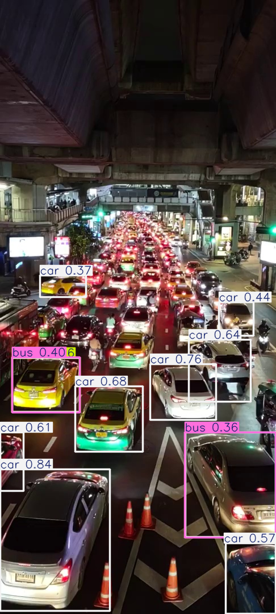

# 🚦 AI-Powered Vehicle Queue & Wait-Time Monitoring

An intelligent traffic-monitoring prototype combining **computer vision, real-time vehicle tracking, decision-support logic, and agentic AI** to detect vehicle queues, estimate wait times, identify congestion, and recommend operational actions.

The system uses **YOLOv8**, **OpenCV**, **LangChain**, and the **OpenAI API** to transform video footage into actionable queue telemetry.

---

## 🎯 Project Objective

Traffic congestion and long vehicle queues can create operational bottlenecks that are difficult to monitor manually.

This project explores how computer vision and AI agents can support traffic and transportation operations by automatically:

* Detecting vehicles from video footage
* Tracking vehicles across frames
* Measuring the number of vehicles currently inside a defined queue zone
* Estimating average vehicle wait time
* Classifying congestion conditions
* Providing queue telemetry to an AI agent
* Generating operational recommendations when intervention may be required

---

## 🏗️ System Architecture

```text
Traffic Video
      ↓
YOLOv8 Vehicle Detection
      ↓
Persistent Vehicle Tracking
      ↓
Queue Region Monitoring
      ↓
Queue Length + Wait-Time Estimation
      ↓
Decision-Support Logic
      ↓
AI Agent
      ↓
Operational Recommendation / Alert
```

---

## 👁️ Computer Vision Pipeline

The system processes traffic video frame by frame using a pretrained **YOLOv8** object-detection model.

Detected vehicles are filtered to relevant classes such as:

* Cars
* Buses
* Trucks

Persistent tracking IDs are used to follow vehicles across frames and prevent the same vehicle from being repeatedly counted as a new vehicle.

A predefined queue region determines when a tracked vehicle enters or exits the monitored area.

---

## ⏱️ Queue & Wait-Time Monitoring

For every video frame, the system calculates operational metrics including:

* **Queue length** — number of tracked vehicles currently within the queue region
* **Average wait time** — estimated time vehicles have remained within the monitored region
* **Congestion status** — rule-based classification of current traffic conditions

Example output:

```text
Queue Length: 3 vehicles
Average Wait Time: 13.71 seconds
Status: Moderate congestion
```

Frame-level telemetry is exported to `queue_metrics.csv` for further analysis.

---

## 🤖 Agentic AI Integration

The computer-vision pipeline is connected to an AI agent using **LangChain** and the **OpenAI API**.

The agent can access queue telemetry through tools and evaluate current operating conditions.

When congestion thresholds are exceeded, the agent can:

1. Retrieve current queue telemetry
2. Diagnose the congestion condition
3. Determine whether intervention is appropriate
4. Generate recommended operational actions
5. Trigger an operational alert

This demonstrates how computer vision can be combined with **agentic AI** to move beyond passive monitoring toward intelligent operational decision support.

---

## 📸 Detection Example



The example above shows YOLO-based vehicle detection on a dense urban traffic scene. Detection accuracy may vary for distant, partially occluded, or low-confidence vehicles.

---

## 🛠️ Technology Stack

* **Python**
* **YOLOv8 / Ultralytics**
* **OpenCV**
* **NumPy**
* **Pandas**
* **Matplotlib**
* **LangChain**
* **OpenAI API**
* **Google Colab**

---

## 📁 Repository Structure

```text
vehicle-queue-monitor/
│
├── Computer_Vision_and_Wait_time.ipynb
├── README.md
├── requirements.txt
├── queue_metrics.csv
├── results.png
└── video.mp4
```

### Key Files

**`Computer_Vision_and_Wait_time.ipynb`**
End-to-end implementation covering vehicle detection, tracking, queue monitoring, wait-time estimation, decision logic, and AI-agent integration.

**`queue_metrics.csv`**
Frame-level queue length, average wait time, and congestion-status output.

**`results.png`**
Example visualization of vehicle detection results.

**`video.mp4`**
Sample traffic video used to demonstrate the prototype.

---

## 🚀 Current Capabilities

* ✅ Vehicle detection using YOLOv8
* ✅ Persistent vehicle tracking across video frames
* ✅ Queue-region monitoring
* ✅ Current queue-length estimation
* ✅ Vehicle wait-time estimation
* ✅ Congestion classification
* ✅ Structured telemetry generation
* ✅ LangChain tool integration
* ✅ AI-agent interpretation of queue conditions
* ✅ Operational alert generation

---

## 🔮 Future Improvements

This project is a prototype and can be extended with:

* Improved detection of distant and heavily occluded vehicles
* Custom-trained traffic detection models
* Dynamic queue-region configuration
* Historical congestion analytics
* Real-time camera-stream processing
* Automated threshold calibration
* Operations dashboards and visualization
* Slack, Microsoft Teams, or email alert integrations
* Human approval workflows for high-impact actions
* Evaluation across different traffic, lighting, and weather conditions

---

## 💡 Product Vision

The broader goal is to demonstrate how **computer vision and agentic AI can transform raw operational data into actionable decisions**.

Rather than only detecting vehicles, the system creates an end-to-end workflow:

**Observe → Measure → Evaluate → Recommend → Act**

This architecture could be adapted to transportation hubs, parking facilities, drive-through operations, border checkpoints, logistics centers, and other environments where queue visibility and rapid operational response are important.

---

## ⚠️ Prototype Disclaimer

This project is an experimental prototype developed for learning and portfolio purposes. Queue measurements and operational recommendations have not been validated for production traffic-management or safety-critical use.
